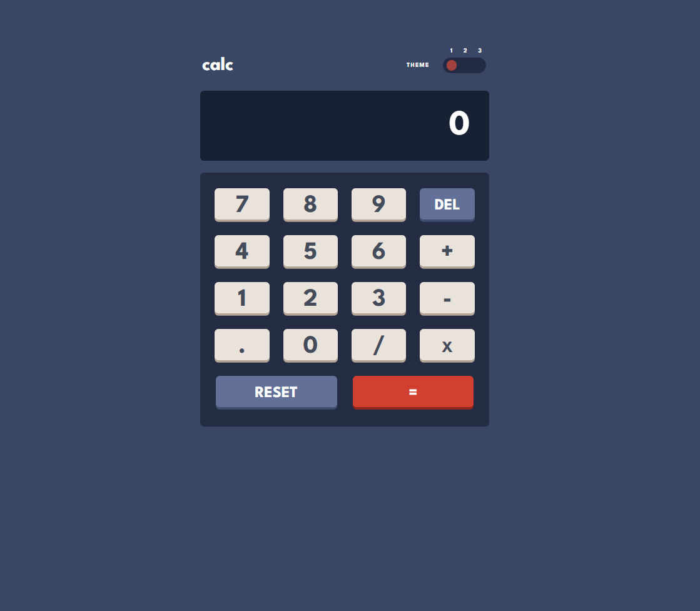

# Frontend Mentor - Calculator app solution

This is a solution to the [Calculator app challenge on Frontend Mentor](https://www.frontendmentor.io/challenges/calculator-app-9lteq5N29).

## Table of contents

- [Overview](#overview)
  - [The challenge](#the-challenge)
  - [Screenshot](#screenshot)
- [My process](#my-process)
  - [Built with](#built-with)
  - [What I learned](#what-i-learned)
  - [Continued development](#continued-development)

## Overview

### The challenge

Users should be able to:

- See the size of the elements adjust based on their device's screen size
- Perform mathematical operations like addition, subtraction, multiplication, and division
- Adjust the color theme based on their preference

### Screenshot

## My process

### Built with

- Semantic HTML5 markup
- CSS custom properties
- Flexbox
- CSS Grid
- Mobile-first workflow
- JavaScript

### What I learned

- HTML and CSS Skills: By completing this project, I enhanced my skills in HTML and CSS. I learned how to create responsive and accessible user interfaces.
- JavaScript Usage: Implementing the logic for the calculator app required me to use JavaScript. I learned how to handle events, manipulate the DOM, and manage the application's state.
- User Interface Design: I gained experience in designing user interfaces that are user-friendly and visually appealing, including making choices related to colors, fonts, and layout.
- Debugging and Problem-Solving: Throughout the project, I encountered challenges and bugs, which taught me effective strategies for debugging and problem-solving.
- Code Organization: I learned how to organize my code and break it into manageable parts, making it easier to maintain and extend.
- Responsiveness: I learned how to make the application responsive so that it works well on different devices and screen sizes.
- Code Optimization: I discovered how to optimize my code for better performance and an improved user experience.

### Continued development

- Advanced JavaScript Concepts: I want to deepen my understanding of advanced JavaScript concepts, such as asynchronous programming, promises, and async/await. This will help me build more complex applications.
- CSS Frameworks: While I have a good grasp of CSS, I want to explore CSS frameworks like Bootstrap or Tailwind CSS to streamline my styling process and learn best practices for responsive design.
- Testing: I want to focus on writing tests for my applications. Learning testing frameworks like Jest or Mocha will help me ensure my code is reliable and maintainable.
- Accessibility (a11y): I want to continue improving my knowledge of web accessibility standards to ensure that my applications are usable for all users, including those with disabilities.
- Performance Optimization: I want to learn more about performance optimization techniques, such as code splitting, lazy loading, and minimizing render-blocking resources to enhance user experience.
- Responsive Design Techniques: While I have learned the basics of responsive design, I want to refine my skills in using media queries and flexible layouts to create seamless experiences across various devices.
- Version Control Best Practices: I want to improve my understanding of version control best practices, including branching strategies and commit message conventions, to enhance collaboration in team projects.
- Deployment and DevOps: I want to learn more about deploying applications and understanding DevOps practices, including CI/CD pipelines, to streamline the development process.
